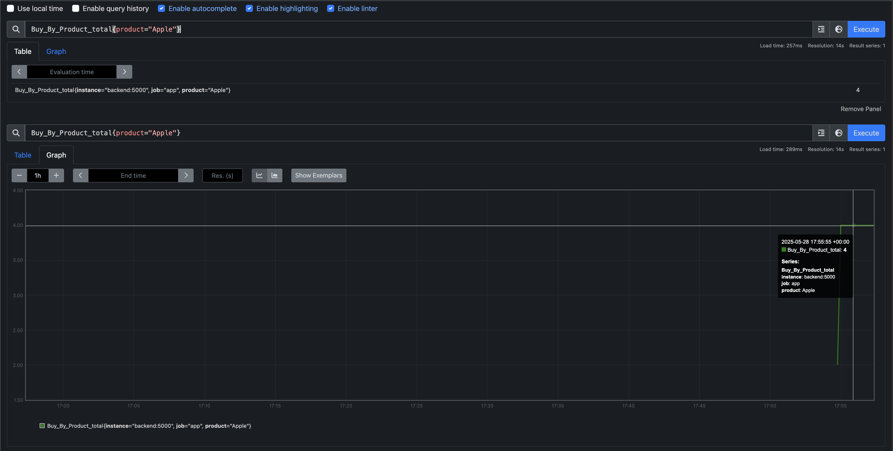
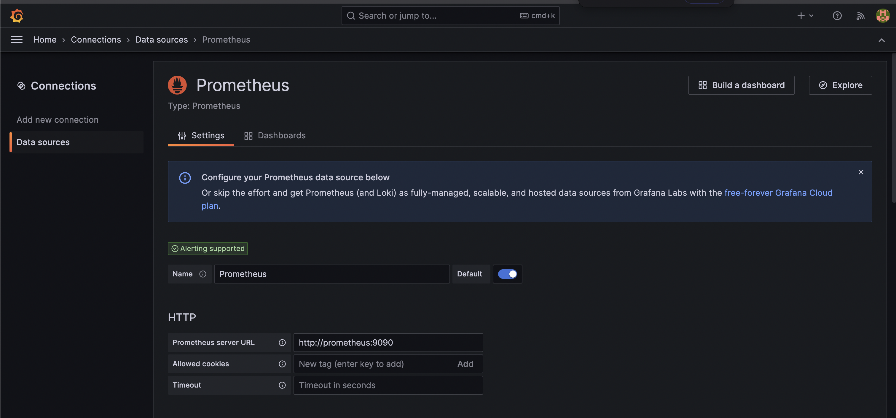
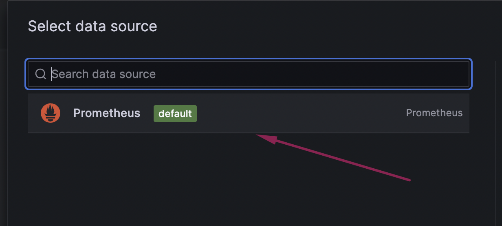
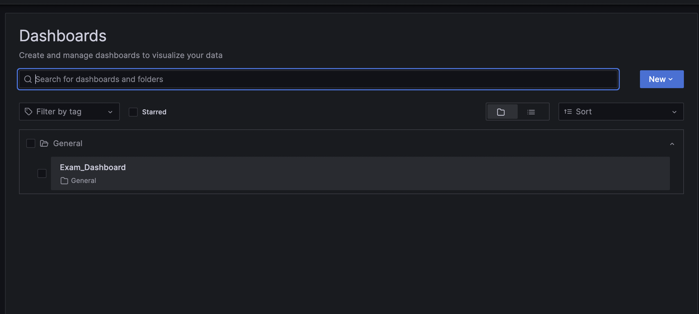
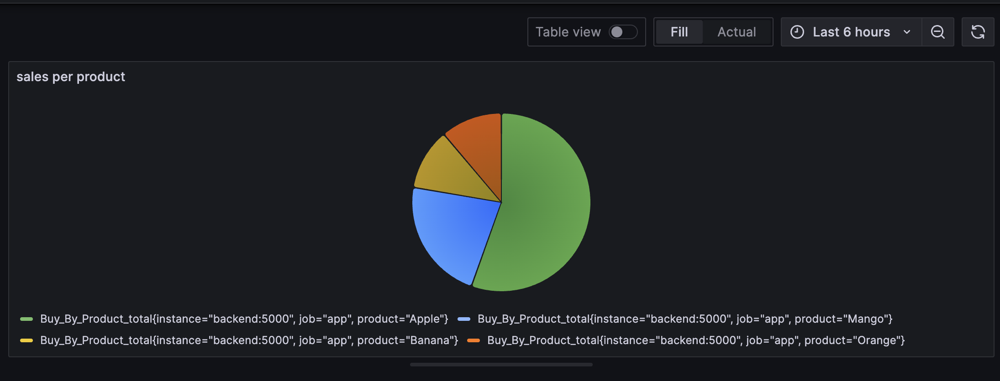
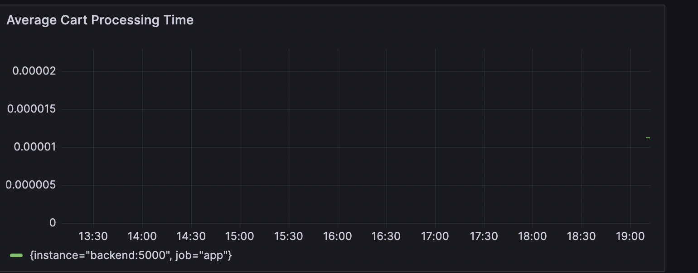
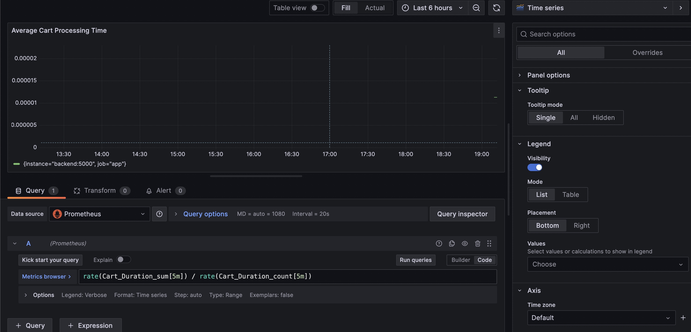
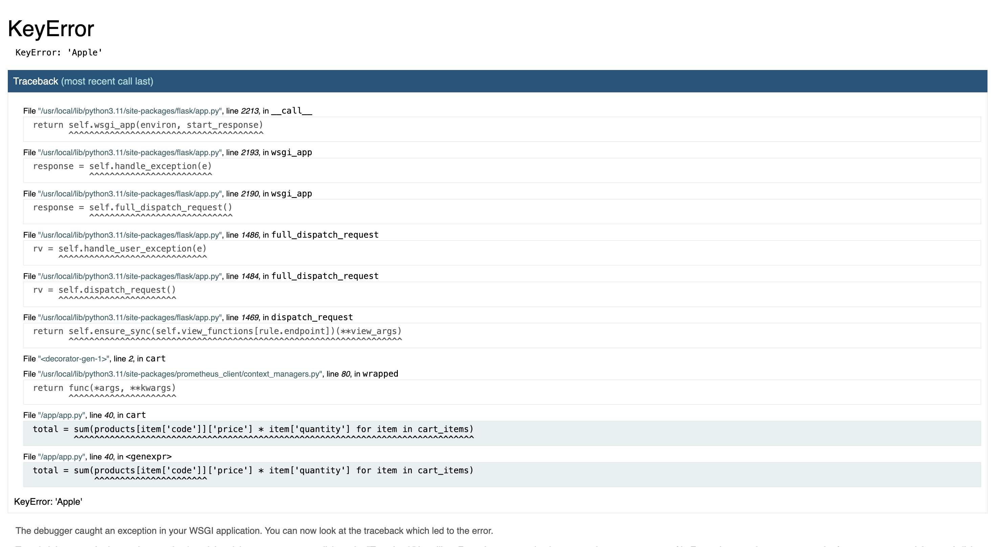

Prometheus query to show the number of times the product “Apple” is purchased
Buy_By_Product_total{product="Apple"}

Add prometheus as data source in grafana

First panel dashboard

Second panel dashboard

Note: The /card endpoint is crashing so the second dashboard is empty

